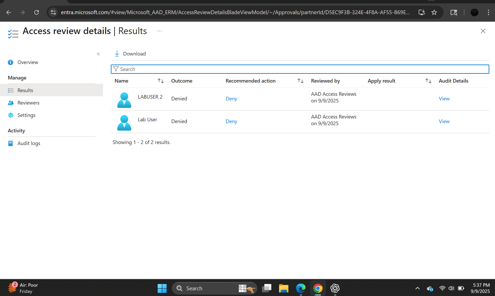
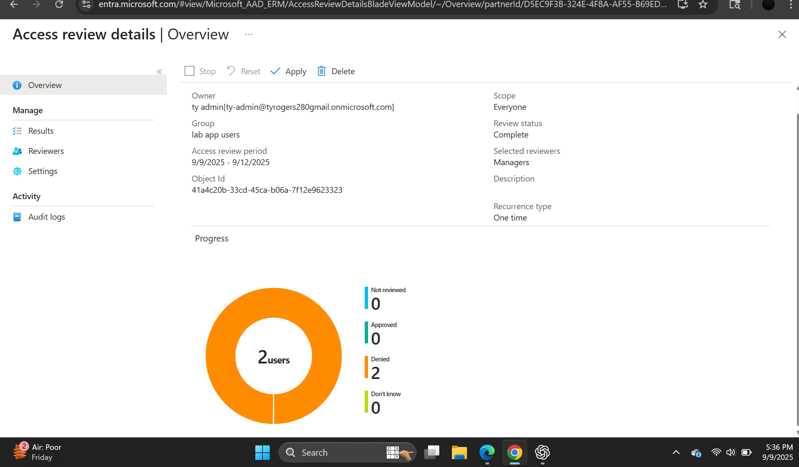
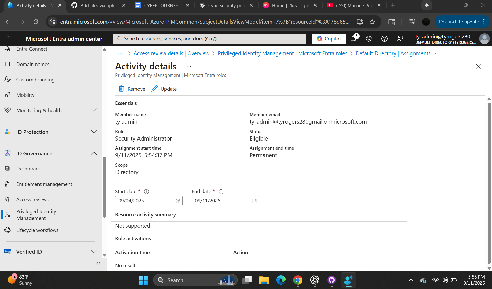

# Lab Evidence (Screenshots)

Below are the proof-of-work screenshots for the **Microsoft Entra ID – Access & ID Tokens Lab**.  
Each image is referenced with a brief caption. Replace any placeholder text with your own notes as needed.

Screenshot 01: _Access Review results page._

Screenshot 02: _Completed Access Review confirmation._

Screenshot 03: _Privileged Identity Management (PIM) overview._

Screenshot 04: _Token decoding step._

Screenshot 05: _User assignment results._

Screenshot 06: _Graph API `/me` call._

Screenshot 07: _Role activation confirmation._

Screenshot 08: _Final access token validation._
